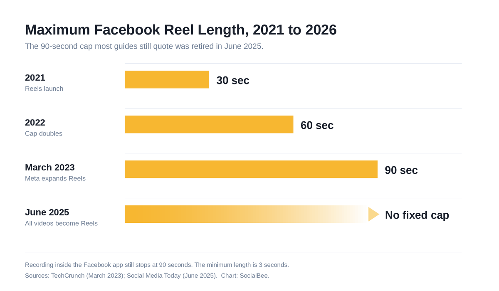
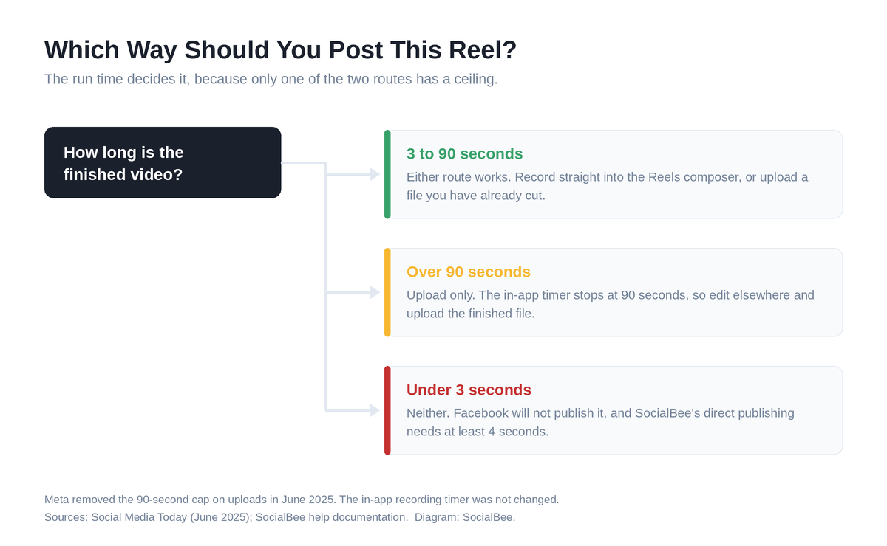
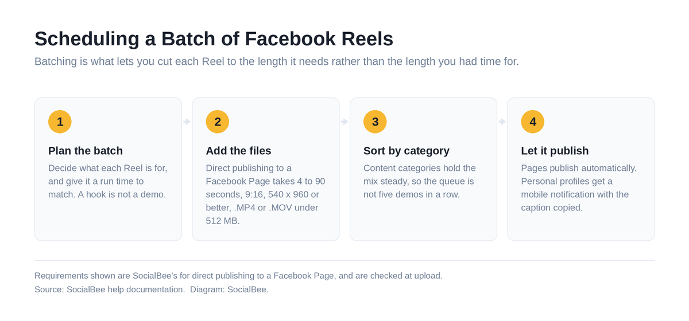

# How Long Can a Facebook Reel Be? 2026 Limits and Best Run Times

There isn't a fixed maximum any more. Meta scrapped the 90-second cap in June 2025, when it turned every Facebook video into a Reel, so an uploaded Reel can run as long as you want it to on an updated account. Record inside the app, though, and 90 seconds is still your ceiling. Minimum is 3.

## Key Takeaways

- No hard ceiling on uploaded Reels since June 2025, when the 90-second cap was scrapped.
- Filming in the app is the exception. It still cuts you off at 90 seconds, so anything longer has to be uploaded as a finished file.
- Minimum: 3 seconds. SocialBee's direct publishing wants 4.
- Most business Reels still do best somewhere between 15 and 60 seconds.
- What Facebook rewards is completion, not duration. Cut to the length your point actually needs.

You cut a video and now you're checking whether it'll fit. That answer moved in 2025, and plenty of the advice still floating around predates the change.

## What's the Maximum Length of a Facebook Reel in 2026?

Two separate limits exist. One governs the video you upload from your computer, the other governs the video you record inside the Facebook app, and mixing them up is what causes most of the confusion online.

### Uploaded Reels: No Fixed Cap

Send Facebook a finished video file and it stops enforcing any maximum duration at all. Meta confirmed in June 2025 that everything you post to Facebook except Stories and Live would publish as a Reel, and the 90-second restriction was dropped at that point. Horizontal footage gets shown in a vertical frame rather than refused.

Rollout was gradual, by region and by account type. Two colleagues can open the same composer on the same morning and be shown different limits. Still getting rejected over 90 seconds? Your account hasn't been switched.

[TechCrunch covered the earlier jump to 90 seconds](https://techcrunch.com/2023/03/03/meta-rolls-out-new-facebook-reels-features-expands-max-video-length-to-90-seconds/) in March 2023. Two years later came the consolidation that took the ceiling away entirely, [reported by Social Media Today](https://www.socialmediatoday.com/news/facebook-renames-all-videos-reels/750973/).

*[Image source](https://raw.githubusercontent.com/aamir4uu/ishu/refs/heads/claude/facebook-reel-length-post-5fl797/blog/facebook-reel-length/images/facebook-reel-length-limits-2021-2026.png)*

### Reels Recorded in the App: 90 Seconds

Recording works differently. Open the Reels composer and you're on a timer that still tops out at 90 seconds on most accounts.

Want a four-minute Reel? Film and edit it elsewhere, then upload the file.

*[Image source](https://raw.githubusercontent.com/aamir4uu/ishu/refs/heads/claude/facebook-reel-length-post-5fl797/blog/facebook-reel-length/images/facebook-reel-post-route-decision.png)*

### The Minimum Length

Facebook needs 3 seconds. Below that, it won't publish. Scheduling tools set their own floor too, so check yours before you build a whole batch around a run time the tool won't accept. SocialBee's direct publishing to Facebook Pages takes **4 to 90 seconds** at a 9:16 ratio, 540 x 960 or better, as an .MP4 or .MOV under 512 MB. Our [free social media resources](https://socialbee.com/resources/) include planning templates.

## How Long Should a Facebook Reel Be?

You can post a six-minute Reel. Whether anyone watches it is a different question.

For most business content, aim somewhere between 15 and 60 seconds. That's enough room for one clear point, and short enough that people stay to the end of it. Match the run time to the job rather than to the maximum:

1. **Hooks and single tips** live at 7 to 15 seconds. One idea, no setup, out.
2. **Product demos and how-tos** usually need 30 to 60, because showing a real workflow takes that long.
3. **Explainers and interviews** can run to three minutes. Only worth it once an audience already knows who you are.

Padding is the mistake. Stretch a 45-second Reel to 90 and you don't win 45 more seconds of attention, you just hand viewers a clearly marked place to leave, right at the point the video stops moving.

## Does Reel Length Affect Reach on Facebook?

Not directly. Facebook doesn't rank Reels by how long they are.

It watches completion.

Twenty-five seconds that people finish beats ninety that lose half the room in the first five. Shorter Reels win because short videos are easier to finish, which is a different thing from the algorithm preferring them. Our breakdown of the [Facebook algorithm](https://socialbee.com/blog/facebook-algorithm/) covers what else gets weighted.

Then check your own numbers, because none of this beats your own data: sort your Reels analytics by average watch time, find where the drop-offs cluster, and cut to just before that point.

## Facebook Reel Specs to Check Before You Post

A Reel of exactly the right duration will still get rejected, or publish looking soft and blurry, if the file doesn't meet spec.

| Spec | Requirement |
| --- | --- |
| Length, uploaded | 3 seconds minimum, no fixed maximum on updated accounts |
| Length, in-app recording | 90 seconds maximum |
| Length, SocialBee direct publishing | 4 to 90 seconds |
| Aspect ratio | 9:16 vertical |
| Resolution | 1080 x 1920 recommended, 540 x 960 minimum |
| File size | Under 512 MB for direct publishing |
| Format | .MP4 or .MOV |

Posting across several platforms? Every one of them wants something slightly different, and our guide to [social media video sizes](https://socialbee.com/blog/social-media-video-sizes/) lists the lot.

## How to Schedule Facebook Reels With SocialBee

Rushing is what makes you settle for the wrong length.

SocialBee publishes Reels straight to your Facebook Pages. Queue Tuesday's 12-second hook and Thursday's demo, which needs a full minute, in the same sitting without switching apps once. Each one gets a preview before it goes out, and content categories keep the mix from turning into five demos in a row. On a personal profile you get a mobile notification at post time instead, caption copied and file ready.

*[Image source](https://raw.githubusercontent.com/aamir4uu/ishu/refs/heads/claude/facebook-reel-length-post-5fl797/blog/facebook-reel-length/images/facebook-reel-scheduling-workflow.png)*

Here's the full walkthrough: [how to schedule Reels on Facebook](https://socialbee.com/blog/can-you-schedule-reels-on-facebook/).

## Frequently Asked Questions About Facebook Reel Length

**Can a Facebook Reel be 3 minutes long?**
Yes, if you upload it as a finished file and your account has the June 2025 update. The in-app camera still won't record that long.

**What's the shortest a Facebook Reel can be?**
3 seconds. Through SocialBee's direct Facebook Page publishing, 4 seconds.

**Why does my Facebook Reel still cap at 90 seconds?**
Your account probably hasn't received the change yet. Try uploading a finished file instead of recording in the app, and check whether you're posting to a Page or a personal profile.

**Do longer Facebook Reels get less reach?**
Not because of their length. Fewer people finish them, and completion is what Facebook rewards.

**Is there a length limit for Facebook Reels ads?**
Meta publishes no maximum for the Reels placement. Keep ads under 30 seconds regardless, because a cold audience gives you very little patience.

**Can I post a horizontal video as a Reel?**
You can, and it'll publish. It gets shown in a vertical frame, so shoot 9:16 when you have the choice.

## Getting Facebook Reel Length Right

The Facebook Reel length limit is looser than it's ever been, which is a mixed blessing. You have room for a longer story now, but the Reels that travel furthest are still the ones people finish.

So let the message set the length. Your watch-time data will tell you where people leave, and that number is worth more than whatever ceiling Facebook happens to allow this year.

Ready to stop posting Reels one at a time? [Start your 14-day free SocialBee trial](https://socialbee.com/) and schedule a month of Facebook Reels in an afternoon. No credit card needed.
