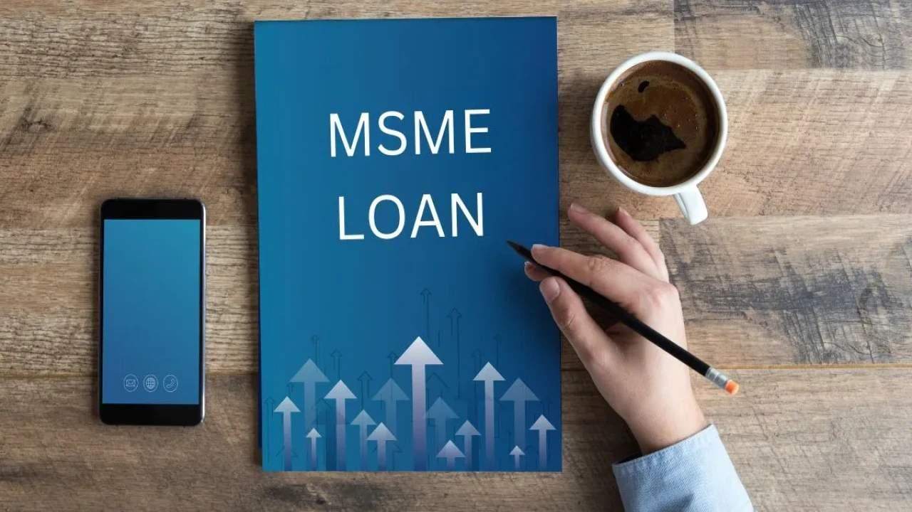

# What Is an MSME Loan? Meaning, Types, Eligibility & How to Apply in 2026

<!-- EDIT: H1 capitalisation corrected to APA ("What is" became "What Is"). -->

[Image Source](https://www.herofincorp.com/blog/msme-loan)

Meet Vikram, a packaging manufacturer from Pune. His factory runs at full capacity and he has orders worth Rs 80 lakh lined up, but his clients pay on 60-day credit terms. The problem? He needs Rs 25 lakh right now to procure raw materials, and he does not have an inch of spare property to pledge.

This is the funding gap that millions of MSME owners face every year. It is also the exact gap that MSME loans are designed to bridge.

Whether you need working capital to survive a slow quarter, equipment to scale up production, or a credit line to meet a large export order, an MSME loan is the most structured, cost-efficient financing option available to registered small and medium businesses in India. This guide gives you the complete picture: what it is, how it works, what you qualify for, and how to apply.

To Avail Unsecured Business Loans [Apply Now](https://www.herofincorp.com/apply-now/unsecured-business-loans)

## MSME Full Form: What Does MSME Stand For?

MSME stands for Micro, Small, and Medium Enterprises. As defined under the MSMED Act 2006, revised in 2020 and again from 1 April 2025, MSMEs are classified on their investment in plant and machinery or equipment and their annual turnover, with the same criteria applying to both manufacturing and service-sector businesses.

India had 7.83 crore enterprises registered on the Udyam portal as of February 2026, and the sector accounts for about 30% of GDP and 45.8% of exports (Ministry of MSME, 2024-25). They are the engine of India's economic growth, and adequate, timely credit is the fuel that keeps that engine running.

<!-- EDIT: the count, the export share and the classification table were from 2020. Updated to the Ministry of MSME figures (PIB, February 2026 and 2024-25) and the thresholds notified in S.O. 1364(E) of 21 March 2025. The old "11 crore employed" figure was dropped because the ministry now publishes Udyam-reported employment on a different basis. -->

MSME Classification From 1 April 2025:

| Category | Investment in Plant & Machinery or Equipment | Annual Turnover |
| --- | --- | --- |
| Micro Enterprise | Up to Rs 2.5 crore | Up to Rs 10 crore |
| Small Enterprise | Up to Rs 25 crore | Up to Rs 100 crore |
| Medium Enterprise | Up to Rs 125 crore | Up to Rs 500 crore |

Source: Ministry of MSME, Notification S.O. 1364(E) dated 21 March 2025, effective 1 April 2025.

Udyam Registration on udyamregistration.gov.in is mandatory to be officially recognised as an MSME and to access Priority Sector Lending benefits, subsidised interest rates, and government guarantee schemes.

## What Is an MSME Loan?

An MSME loan is a credit facility specifically designed for businesses registered as Micro, Small, or Medium Enterprises under the Udyam portal. These loans provide structured financing to meet working capital requirements, fund business expansion, purchase equipment and machinery, or manage cash flow gaps during growth phases.

MSME loans are offered by public and private sector banks, Non-Banking Financial Companies ([NBFCs](https://www.herofincorp.com/blog/what-is-nbfc)), and Micro Finance Institutions (MFIs) in both secured (collateral-backed) and unsecured (collateral-free) formats. Government-backed guarantee schemes like CGTMSE have made collateral-free MSME loans widely accessible, even for businesses without significant physical assets to pledge.

The key distinction between a regular business loan and an MSME loan lies in the regulatory classification: MSME loans qualify under Priority Sector Lending (PSL) norms mandated by the Reserve Bank of India, which means lenders are incentivised to extend credit to this segment, often at lower interest rates and with more flexible terms than standard commercial loans.

<!-- NEW SECTION START: How Is an MSME Loan Used? Brief: listicle, about 70 words, informational, reference Axis Bank. -->
## How Is an MSME Loan Used?

Most MSME loans come without end-use restrictions, and borrowers spread the money across a handful of needs.

- Working capital comes first: raw material, stock ahead of the festive season, salaries through a slow month.
- Expansion, whether that means a second unit, a bigger godown or a product line the existing plant can't make.
- Machinery and technology.
- Export finance, both pre-shipment and post-shipment.
- Refinancing costlier debt, which is how a manufacturer paying 18% on an overdraft ends up with a 12% term loan and a smaller monthly outflow.
<!-- NEW SECTION END -->

## Types of MSME Loans in India

MSME businesses have diverse financing needs. Lenders have structured loan products accordingly:

### 1. Term Loans

A lump-sum disbursement repaid in fixed EMIs over an agreed tenure of 12 to 84 months. Best suited for capital expenditure: purchasing machinery, expanding a production facility, or setting up a new business unit.

### 2. Working Capital Loans

Short-term credit facilities to manage day-to-day operational expenses: raw material procurement, inventory management, payroll and vendor payments. Often structured as overdraft (OD) facilities or revolving credit lines, so businesses can draw and repay as needed.

### 3. Equipment and Machinery Finance

A specialised loan for purchasing business-specific equipment. The asset procured typically doubles as collateral, which brings lower interest rates and higher loan-to-value ratios. Popular in manufacturing, food processing and healthcare.

### 4. Invoice Discounting or Bill Financing

Lets businesses raise liquidity from unpaid customer invoices before the payment due date. A lender advances 70% to 90% of the invoice value, charging interest only for the period of advance. Ideal for export-heavy or B2B businesses facing long payment cycles.

### 5. Collateral-Free MSME Loans (Unsecured)

Backed by government guarantee schemes like CGTMSE, these loans require no pledge of property or machinery. Creditworthiness is evaluated on GST history, bank statements and cash flow rather than asset ownership. Available from banks and NBFCs alike.

## Secured vs. Unsecured MSME Loans: Key Differences

Understanding this distinction helps you choose the right product based on your asset position, urgency and risk appetite:

| Feature | Secured Loan | Unsecured (Collateral-Free) Loan |
| --- | --- | --- |
| Asset Pledge | Required (property or equipment) | Not required |
| Loan Amount | Higher, up to Rs 10 crore and above | Up to Rs 10 crore (CGTMSE); Rs 50 lakh (NBFCs) |
| Interest Rate | Lower (8% to 12% p.a.) | Higher (12% to 24% NBFCs; 8.5% to 15% banks under CGTMSE) |
| Processing Time | 7 to 30 days | 24 to 72 hours (digital lenders) |
| Ideal For | Established businesses with assets | Growing businesses without pledgeable assets |

For most growth-stage MSMEs, a collateral-free loan backed by CGTMSE offers the best balance of access, speed and cost.

## Top Government Schemes for MSME Loans in India (2026)

India's policy framework for MSME credit is among the most comprehensive in Asia. Here are the schemes you should know:

### 1. CGTMSE: Credit Guarantee Fund Trust for Micro and Small Enterprises

The CGTMSE is the cornerstone of India's collateral-free lending framework. It provides a guarantee cover of up to 85% for loans up to Rs 5 lakh and up to 75% for larger loans, so lenders can sanction credit without requiring physical security from the borrower.

- 2025 update: The ceiling for guarantee coverage was raised from Rs 5 crore to Rs 10 crore from 1 April 2025.
- Women-led MSMEs are eligible for enhanced coverage of up to 90%.
- SC/ST-owned enterprises receive priority processing and additional subsidy benefits.

<!-- EDIT: "2026 Update" changed to the actual date of the ceiling change, 1 April 2025 (Union Budget 2025-26). -->

### 2. MUDRA Loans: Pradhan Mantri Mudra Yojana (PMMY)

Provides micro-finance to non-corporate, non-farm small businesses through four structured categories:

- Shishu: Up to Rs 50,000 for nascent enterprises just starting operations.
- Kishore: Rs 50,001 to Rs 5 lakh for businesses in an early growth phase.
- Tarun: Rs 5 lakh to Rs 10 lakh for established micro-enterprises seeking expansion.
- Tarun Plus: Up to Rs 20 lakh for borrowers with a clean Tarun loan repayment track record (introduced in Union Budget 2024-25).

### 3. MSME Loans in 59 Minutes: PSB59 Portal

A digital-first government portal offering in-principle approval for MSME loans up to Rs 5 crore in under 60 minutes. It integrates live GST, [ITR](https://www.herofincorp.com/blog/what-is-itr-in-india) and bank data for real-time risk assessment, which removes the traditional paperwork bottleneck. Particularly useful for businesses seeking Rs 1 crore to Rs 5 crore quickly through public sector lending institutions.

### 4. Stand-Up India Scheme

Facilitates lending institution loans between Rs 10 lakh and Rs 1 crore to at least one SC/ST borrower and at least one woman borrower per lending institution branch. Specifically designed for greenfield enterprises in manufacturing, services, or trading sectors.

### 5. Special Credit Linked Capital Subsidy Scheme (SCLCSS)

The general CLCSS, which paid a 15% capital subsidy on machinery, closed on 31 March 2020. What remains is the Special CLCSS for SC/ST-owned micro and small enterprises: a 25% capital subsidy on plant and machinery, with an investment ceiling of Rs 1 crore, across manufacturing and service sectors.

<!-- EDIT: this scheme entry described the general CLCSS as live. The Ministry of MSME discontinued it (component closed 31 March 2020, discontinuation notice March 2021); only the Special CLCSS for SC/ST enterprises operates. Rewritten. -->

Also Read: [Business Loan vs Personal Loan: Which Is Best for Entrepreneurs?](https://www.herofincorp.com/blog/business-loan-vs-personal-loan-for-entrepreneurs)

Key Insight: Most government schemes are administered through PSBs and NBFCs. The PSB59 portal (psbloansin59minutes.com) is the fastest entry point for in-principle approval across multiple lenders simultaneously.

## Key Benefits of an MSME Loan

### No Collateral Required

Under CGTMSE-backed schemes, you can access funding of up to Rs 10 crore without pledging property, machinery, or personal assets. This removes the single biggest barrier to credit for growing businesses.

### Competitive Interest Rates

MSME loans extended under Priority Sector Lending carry interest rates starting from 8.5% p.a. through public sector lending institutions, well below standard commercial loan rates. NBFCs typically offer rates between 12% and 17.9% p.a. with faster processing.

### Fast, Digital Processing

Digital lending platforms assess GST data and bank statements in real time. Approval and disbursement can happen within 24 to 72 hours, so your business can act on opportunities without delay.

### Flexible End-Use

Unlike equipment loans or invoice financing, most working capital MSME loans carry no end-use restrictions. Use the funds for hiring, raw materials, marketing, or any business purpose.

### Tax Efficiency

The interest paid on MSME loans is fully deductible as a business expense under the Income Tax Act, reducing your effective cost of borrowing.

### Builds Business Credit History

Every timely repayment improves your business's CIBIL MSME Rank (CMR). A better CMR opens the door to larger loan amounts and more favourable terms in future, creating a virtuous credit cycle for your enterprise.

<!-- EDIT: "CIBIL Commercial Rank (CCR)" corrected to "CIBIL MSME Rank (CMR)"; CCR is the Company Credit Report, CMR is the 1 to 10 rank lenders use. -->

## MSME Loan Eligibility Criteria

Eligibility parameters vary across lenders and schemes, but these are the general benchmarks for most collateral-free MSME loans:

| Eligibility Parameter | Requirement |
| --- | --- |
| Age of Applicant | 21 to 65 years |
| Business Registration | Active Udyam Registration Certificate (mandatory) |
| Business Vintage | Minimum 1 to 3 years (varies by scheme; MUDRA accepts newer businesses) |
| Credit Score (CIBIL) | 700+ minimum; 750+ for competitive interest rates |
| GST Registration | Mandatory for turnover above Rs 40 lakh; preferred otherwise |
| Annual Turnover | As per MSME classification thresholds |
| Existing Obligations | Total EMIs preferably not exceeding 50% of monthly income |

Important: Government schemes like MUDRA (Shishu and Kishore) are far more lenient for newer businesses with shorter operating histories. NBFCs look at the whole picture: strong GST returns and clean bank statements can offset a slightly lower credit score.

## Documents Required for an MSME Loan

Incomplete documentation is the most common reason for processing delays. Having these ready before you apply can cut your approval time considerably:

### Identity and KYC Documents

- Aadhaar Card (all applicants, directors, or partners).
- PAN Card of the individual and business entity.
- Passport or Voter ID (as supplementary identity proof).

### Business Registration and Legal Documents

- Udyam Registration Certificate (mandatory for all MSME loans).
- GST Registration Certificate and last 12 months' GST returns.
- Certificate of Incorporation, Partnership Deed or Shop & Establishment Certificate.
- Memorandum of Association (MoA) and Articles of Association (AoA) for companies.

### Financial Documents

- Last 2 years' Income Tax Returns (ITR) with audited Profit & Loss statement and balance sheet.
- Last 6 to 12 months' bank statements (current account preferred).
- GST-linked bank statement showing business transaction history.

### Additional Documents (for Loans Above Rs 25 Lakh)

- CA-certified financial statements.
- Projected cash flow statement for the loan period.
- Details of existing loans, if any.

## How to Apply for an MSME Loan Step-by-Step

1. Register on Udyam Portal: Ensure your Udyam Registration Certificate is active and updated with accurate investment and turnover figures. This is non-negotiable for all government-backed MSME loan schemes.
2. Define Your Requirement: Determine the loan type needed (term loan, working capital, or equipment finance). Calculate the exact amount based on your business plan or cash flow projections. Avoid over-borrowing.
3. Choose the Right Scheme and Lender: Compare interest rates, processing fees, disbursal timelines and prepayment charges. For collateral-free loans up to Rs 50 lakh with fast disbursal, NBFCs and digital lenders are worth evaluating alongside banks.
4. Complete the Online Application: Fill the application form with your GSTIN and PAN. On platforms like PSB59, your GST and ITR data is pulled automatically, which reduces manual data entry.
5. Upload KYC and Financial Documents: Submit digitised copies of all documents listed above. Ensure bank statements are recent and uninterrupted.
6. Review the Key Fact Statement ([KFS](https://www.herofincorp.com/blog/key-fact-statement-meaning)): As per RBI's 2024 mandate, every lender must provide a KFS before disbursal disclosing the [Annual Percentage Rate (APR)](https://www.herofincorp.com/blog/what-is-annual-percentage-rate), processing fees, prepayment charges, and all other costs. Read it carefully before signing.
7. Receive Disbursal: Post-verification, funds are credited directly to your current account within 24 to 72 hours for digital lenders, and 7 to 30 days for lending institution-based loans.

## How to Maximise Your MSME Loan Approval Chances

Beyond meeting the basic eligibility criteria, these steps meaningfully improve your approval odds and the rates you are offered:

- Maintain clean bank statements: Avoid cheque bounces, maintain a healthy average monthly balance, and ensure your current account shows regular business inflows for at least 6 months.
- File GST returns without gaps: Lenders use GSTIN data as the primary proxy for revenue verification. Gaps in filings are a red flag regardless of your actual turnover.
- Keep your Udyam certificate current: Confirm annual renewal and update your investment and turnover data accurately. Mismatches trigger manual verification delays.
- Manage credit utilisation: Keep existing credit card and overdraft utilisation below 30% of sanctioned limits; this directly lifts your CIBIL score.
- Reduce your debt-to-income ratio: Existing EMIs should ideally not exceed 50% of monthly income. Closing small outstanding loans before applying for a larger MSME loan improves the approval probability substantially.
- Maintain a separate current account: Lenders prefer businesses that route all transactions through a single dedicated current account; it makes your cash flow story cleaner and easier to underwrite.

## Frequently Asked Questions

### What Is an MSME Loan, and Who Can Apply for It?

An MSME loan is a credit facility designed for businesses officially registered as Micro, Small, or Medium Enterprises on the Udyam portal. Eligible applicants include sole proprietorships, partnership firms, LLPs and private limited companies that fall within the MSME investment and turnover thresholds. Both manufacturing and service-sector enterprises can apply.

### Can I Get an MSME Loan Without Collateral?

Yes. Under the CGTMSE scheme, collateral-free MSME loans of up to Rs 10 crore are available through empanelled lending institutions. NBFCs and digital lenders typically offer unsecured MSME loans of up to Rs 50 lakh, evaluated on your GST history, bank statements and CIBIL score rather than physical asset ownership.

### What Is the MSME Loan Interest Rate in 2026?

Interest rates range from 8% to 17.9% p.a. depending on the lender type, the applicable scheme and your individual credit profile. Public sector lending institutions under Priority Sector Lending typically offer rates starting at 8.5% p.a. NBFCs generally charge between 12% and 17.9% p.a., which pays for the speed and flexibility they offer in processing.

### Is Udyam Registration Mandatory for an MSME Loan?

Yes. As per RBI guidelines and the MSMED Act, the Udyam Registration Certificate (URC) is mandatory to classify your business as an MSME and avail Priority Sector Lending benefits, CGTMSE coverage and subsidised interest rates. Registration is free on udyamregistration.gov.in and takes under 30 minutes for Aadhaar-linked applicants.

### What Is the Maximum Amount I Can Borrow Under an MSME Loan?

The maximum varies by scheme: CGTMSE-backed collateral-free loans go up to Rs 10 crore; MUDRA Tarun Plus covers up to Rs 20 lakh; PSB59 facilitates in-principle approval up to Rs 5 crore. For NBFCs and private lenders, unsecured MSME loans typically go up to Rs 50 lakh.

### How Long Does MSME Loan Processing and Disbursal Take?

Digital lenders and NBFCs can approve and disburse funds within 24 to 72 hours. The PSB59 platform offers in-principle approval in under 60 minutes. Lending institution-based loans, particularly secured term loans, typically take 7 to 30 business days due to physical verification and sanction committee approval processes.

### Can a New Business or Startup Apply for an MSME Loan?

Startup-focused government schemes like MUDRA (Shishu and Kishore categories) and Stand-Up India are specifically designed for new businesses and greenfield projects. However, for larger unsecured loans from banks or NBFCs, most lenders require a minimum business vintage of 1 to 3 years to assess repayment capacity through historical financials.

### Are There Prepayment or Foreclosure Charges on MSME Loans?

As per RBI's 2025 directions, effective for loans sanctioned or renewed from 1 January 2026, NBFCs in the Middle Layer cannot levy pre-payment charges on floating-rate loans up to Rs 50 lakh sanctioned to Micro and Small Enterprises. For loans above this threshold or from other lender categories, prepayment terms vary, so always review the Key Fact Statement (KFS) carefully before signing.

<!-- EDIT: added the effective date of the RBI (Pre-payment Charges on Loans) Directions, 2025, and the floating-rate qualifier the directions carry. -->

<!-- NEW SECTION START: four new FAQs from the brief. -->
### What Documents Are Required for an MSME Loan?

Udyam Registration Certificate, PAN and Aadhaar of the owners, business registration proof (GST certificate, partnership deed or incorporation certificate), the last 12 months of bank statements, GST returns for the same period and two years of ITRs with financials. For an unsecured loan from an NBFC that's usually the whole list, and secured loans add the property or machinery papers on top.

### What Is the Repayment Tenure for an MSME Loan?

Working capital facilities run 12 months and renew. Term loans run longer. Banks stretch machinery and expansion loans from 12 to 84 months, unsecured business loans from NBFCs usually sit between 12 and 60 months, and MUDRA loans are repaid over three to five years on a schedule the sanctioning bank sets.

### Are There Subsidies Available on MSME Loans?

There are some, though none of them come from the lender. PMEGP pays a margin money subsidy of 15% to 35% of the project cost for new units, depending on the applicant's category and on whether the unit is urban or rural. For SC/ST-owned enterprises, the Special CLCSS adds a 25% capital subsidy on machinery within an investment ceiling of Rs 1 crore. Ignore pages still promising the general CLCSS 15% subsidy; it closed in March 2020. CGTMSE gets listed alongside these, but it is a guarantee that lets the lender drop the collateral; no money comes to you.

### Is There a Minimum Credit Score Required for an MSME Loan?

There's no statutory floor, but lenders watch two numbers. Most lenders want the proprietor's personal CIBIL score at 700 or above. Pricing gets sharper from 750. For firms with credit exposure between Rs 10 lakh and Rs 50 crore, the CIBIL MSME Rank counts too: CMR 1 to 4 is comfortable, 5 to 7 gets questions, and 8 to 10 is usually a decline. MUDRA lenders are more lenient with micro units that have no history yet. A year of on-time EMIs moves the rank more than anything else you can do.
<!-- NEW SECTION END -->

## Final Word: Is an MSME Loan Right for You?

An MSME loan is more than a financial product; it is a policy-backed instrument designed to give India's small business owners a fair shot at growth. With collateral-free options, Priority Sector Lending benefits, and a growing ecosystem of digital lenders, meaningful business credit is within reach of registered MSMEs.

The fundamentals are simple: get your Udyam Registration in place, keep your financials clean, and then choose the scheme or lender that fits your business's stage and needs. Whether it is a Rs 5 lakh MUDRA loan to buy equipment or a Rs 50 lakh [working capital](https://www.herofincorp.com/blog/guide-understanding-working-capital-loans) facility to fulfil a large order, the right MSME loan can be the difference between incremental growth and a genuine step-change.

<!-- EDIT: "is not just a financial product it is" and "has never been more achievable" reworded; the "not just X, it is Y" shape is a detector marker. -->

Disclaimer: The information provided in this blog post is intended for informational purposes only. The content is based on research and opinions available at the time of writing. While we strive to ensure accuracy, we do not claim to be exhaustive or definitive. Readers are advised to independently verify any details mentioned here, such as specifications, features, and availability, before making any decisions. Hero FinCorp does not take responsibility for any discrepancies, inaccuracies, or changes that may occur after the publication of this blog. The choice to rely on the information presented herein is at the reader's discretion, and we recommend consulting official sources and experts for the most up-to-date and accurate information about the featured products.
