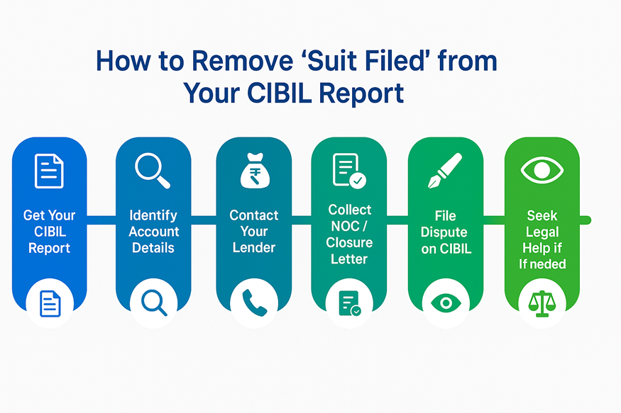
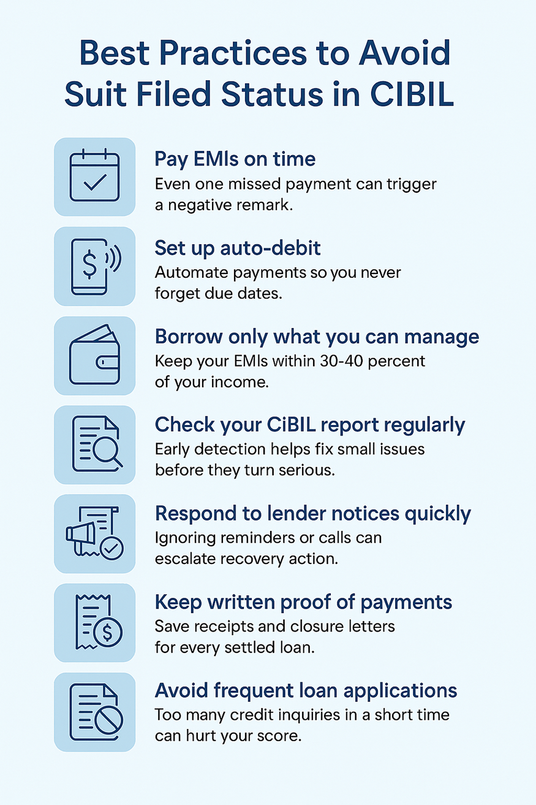

# What Is Suit Filed and How to Remove It in CIBIL Report?

Imagine applying for a loan and spotting "Suit Filed" beside your name. Most borrowers see it only after a rejection. It means a bank or NBFC has started legal action over unpaid dues, and it isn't permanent. Here's what it means and how to get it off your report.

[Image Source](https://www.herofincorp.com/blog/how-to-remove-suit-filed-in-cibil-report)

<!-- H1 capitalisation corrected to APA. Page condensed from about 1,450 words. This brief mandates four new sections and six FAQs, so the page runs above 700 and inside the 1,000-word ceiling. The 45-day dispute follow-up in the live copy was corrected to RBI's 30 days. -->

To Avail Personal Loan [Apply Now](https://loans.apps.herofincorp.com/en/personal-loan?utm_source=website&utm_medium=organic&utm_campaign=Blogsorganic)

## What Does Suit Filed Mean in CIBIL?

"Suit Filed" means your [bank or NBFC](https://www.herofincorp.com/blog/difference-between-banks-and-nbfc) has filed a case to recover unpaid dues and reported it to TransUnion CIBIL, with the date and the amount. Miss several EMIs and ignore the reminders, and the lender can report the account this way. The entry stays until it's cleared. There may be no ruling yet. Only a case exists.

## How Does a CIBIL Suit Filed Impact Your Credit Score?

A CIBIL suit filed remark hurts in two ways, and the second is the one people miss.

- Months of missed payments sit behind it, and they've already dragged the score under the 700 most lenders want.
- The flag sits in the account status, so a lender's policy filter can decline you before a human being ever looks at the score itself.
- Any credit that does come is priced for the risk, and it all stays until the lender updates the record.

## Types of Suit Filed Status in a CIBIL Report

Each account's 'Suit Filed / Wilful Default' field carries one of four values, while written off and settled sit in a field of their own. That is why suit filed, wilful default and written off can turn up together on a single report and still mean three different things.

| Status | What it means |
| --- | --- |
| No Suit Filed | Default value; no legal action reported. |
| Suit Filed | A recovery case has been filed in a civil court or a Lok Adalat, or before a Debt Recovery Tribunal where dues reach Rs 20 lakh. |
| Wilful Default | You could pay and didn't, or diverted the funds. Needs a committee process under RBI's 2024 directions, from Rs 25 lakh up. |
| Suit Filed (Wilful Default) | Both at once. The hardest to shift. |

## How to Check and Remove a Suit Filed Entry

Log in at [cibil.com](http://www.cibil.com/), download the report, and read the status field on every account listed. Then:

[Image Source](https://www.herofincorp.com/blog/how-to-remove-suit-filed-in-cibil-report)

1. Note the lender, the filing date and the amount claimed.
2. The recovery desk can tell you whether the case is still active, and what the balance comes to with penalties and legal costs added.
3. Repay in full, or agree a [settlement](https://www.herofincorp.com/blog/loan-settlement-vs-loan-closure) and get every term of it down in writing before any money moves.
4. A No Dues Certificate or closure letter is the one piece of evidence CIBIL insists on before it will touch the entry, so don't leave the lender without it.
5. Raise a dispute on cibil.com under Credit Report Help and attach that certificate.
6. [Check your report](https://www.herofincorp.com/check-free-credit-score) after 30 days, since the lender gets 21 days to confirm and CIBIL nine more. Still wrong? Escalate to the grievance officer, then a credit lawyer.

## Difference Between Suit Filed, Written-off, and Settled Status

These three remarks describe different stages of the same bad debt, and lenders read them differently.

| Status | What happened | Still owed? | How lenders read it |
| --- | --- | --- | --- |
| Suit Filed | Legal recovery has begun | Yes, plus costs | An active default, and usually an automatic decline. |
| Written-off | Dues written off in the lender's books, typically after 180 days unpaid | Yes, recovery can continue | Serious. Some lenders reconsider once it's paid. |
| Settled | You paid an agreed amount below the full dues | No | Negative, though the softest of the three. |

Order matters here. Suit filed accounts can later show written-off, and a written-off one can end as 'Post (WO) Settled' once you pay part of it. Only full payment gets you to 'Closed' with no remarks. Settled clears the debt but leaves the record.

[Image Source](https://www.herofincorp.com/blog/how-to-remove-suit-filed-in-cibil-report)

## Conclusion

A CIBIL suit filed remark isn't a verdict. It won't leave on its own, either. Pull the report. Clear or settle the account. Collect the closure letter, raise the dispute, then check again in 30 days. Expect a month or two if the lender cooperates, and remember that every loan you apply for meanwhile is priced against the flag. Once it's gone, [Hero FinCorp](https://www.herofincorp.com/personal-loans) can look at you afresh.

## Frequently Asked Questions

### What Is a Suit Filed in CIBIL?

An account status showing your lender has begun legal proceedings to recover overdue dues, reported to TransUnion CIBIL with the date and the amount. A case exists. That's all.

### Does a Suit Filed Status Reduce CIBIL Score?

Indirectly, yes. CIBIL deducts no fixed points for the remark itself, but the score falls because of the months of non-payment sitting behind it, and then the flag does separate damage, since many lenders decline any report carrying one.

### Can the Suit Filed Status Be Removed Instantly From CIBIL?

No. CIBIL confirms with your lender before correcting anything, and that back-and-forth typically takes up to a month from the day you raise it.

### What's the Difference Between Suit Filed and Written-off?

Suit filed means the lender is still chasing the money through the courts. Written-off means it has given up expecting to recover it, usually after 180 days unpaid. One account can carry both.

### Can I Get a Loan While a Suit Filed Entry Is Active?

It's rare, and the terms are poor when it happens, because most lenders treat the remark as an automatic decline rather than something to weigh up. Clear the dues first.

### What Documents Do I Need to Raise a Dispute for Removal?

You'll need the CIBIL report with the entry marked, the No Dues Certificate or closure letter, plus proof of payment and your PAN. If the suit was filed in error, add the lender's letter saying so.

### How to Clear a Suit Filed in CIBIL?

Pay or settle the account, take a No Dues Certificate, then raise a dispute on cibil.com and attach it. Your lender then has 21 days to confirm and CIBIL nine more, and past that 30-day mark RBI's compensation rule pays you Rs 100 a day for the delay.

<!-- The standard Hero FinCorp disclaimer is appended at publish and is not counted toward the length. -->
