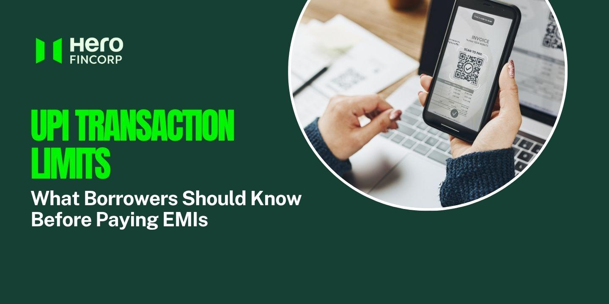

# What Is the UPI Transaction Limit per Day & Month? Complete Guide

[Image Source](https://www.herofincorp.com/blog/upi-transaction-limit)

<!-- H1 changed as the brief suggests; the banner still carries the old title and needs re-titling. Page condensed from about 2,200 words to the 500 to 700 word brief. The sector table's education and healthcare row was corrected on the way. -->

Paying an EMI over UPI is second nature, until the app declines it for crossing a limit you didn't know existed. Here is what NPCI allows per day, what changes for larger payments, and how to check and raise your own cap.

To Avail Personal Loan [Apply Now](https://loans.apps.herofincorp.com/en/personal-loan?utm_source=website&utm_medium=organic&utm_campaign=Blogsorganic)

## What Is the UPI Transaction Limit per Day?

The UPI transaction limit per day is Rs 1 lakh for most people, counted across every UPI app linked to the same bank account. That ceiling comes from NPCI. Banks can go lower, and some hold basic or new accounts at Rs 25,000, so two people can see different limits on the same phone. There's no NPCI monthly cap. Verified merchant categories, loan EMIs among them, run on higher limits of up to Rs 5 lakh a payment.

## How the Caps Work

There's also a count of 20 transactions a day, plus Rs 10,000 per payment on UPI 123Pay and Rs 2,000 per collect request. The daily window is usually rolling, so a cap hit at 11 am clears at 11 am tomorrow; a few banks reset at midnight, and the limit screen in your app says which.

## Higher Limits for Specific Payments

Since 15 September 2025, under NPCI's circular of 28 August 2025, verified merchants in some categories can take much larger payments:

| Category | Per transaction | Per 24 hours |
| --- | --- | --- |
| Loan EMIs and other collections | Rs 5 lakh | Rs 10 lakh |
| Insurance, capital markets, travel, Government e-Marketplace | Rs 5 lakh | Rs 10 lakh |
| Credit card bill payments | Rs 5 lakh | Rs 6 lakh |
| Jewellery | Rs 2 lakh | Rs 6 lakh |
| Hospitals and educational institutions | Rs 5 lakh | As per bank |

Person-to-person transfers stayed at Rs 1 lakh. Above that, IMPS carries up to Rs 5 lakh per transfer and RTGS has no upper limit.

## How to Check or Raise Your UPI Limit

In your UPI app, open Profile, Bank Account, then Check Limit for what's left today and the per-transaction cap. If your bank has capped you below Rs 1 lakh, customer care or a branch can lift it once your KYC is complete; nobody can take you past the ceiling. And since 7 August 2026, under NPCI circular OC-226A, a fingerprint or face scan can approve payments up to Rs 10,000 instead of the PIN. That changes how you authorise. None of the caps above move.

## Conclusion

Daily is the number that matters. Standard UPI transfers are capped at Rs 1 lakh a day, and there's no separate monthly limit of UPI on top of it, so a month's room is simply your bank's daily cap multiplied out. Check the limit screen before a large EMI. If the loan is with [Hero FinCorp](https://www.herofincorp.com/personal-loans), Autopay takes the guesswork out of it.

## Frequently Asked Questions

### What Is the Monthly Limit of UPI?

There isn't a published one. NPCI's caps are per transaction and per 24 hours, so a month's ceiling is your daily cap multiplied out: Rs 30 lakh on a Rs 1 lakh account.

### Is the UPI Transaction Limit the Same Across All Banks?

No. Rs 1 lakh is a ceiling, and each bank sets its own cap underneath it by account type and risk profile. Nobody publishes these in one place, so trust the limit screen in the app.

### How Can I Increase My UPI Limit?

Check the limit screen first, since some banks let you lift a self-set cap on the spot. If the bank itself has capped you, ask customer care or your branch. Above Rs 1 lakh, switch rails to IMPS or RTGS.

### What Happens if I Try to Send More Than My Daily UPI Limit?

Nothing leaves your account; the app declines the payment. Wait for the window to roll over or use IMPS or NEFT for the balance. A declined EMI on the due date still counts as missed.

### Are UPI Limits Different for New Users Versus Existing Users?

Yes. For 24 hours after you set or reset your UPI PIN, the cap is Rs 5,000 across all apps, and banks can't waive it.

<!-- The standard Hero FinCorp disclaimer is appended at publish and is not counted toward the length. -->
