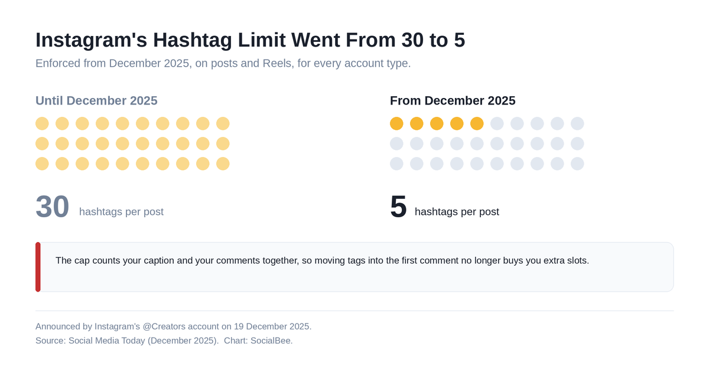
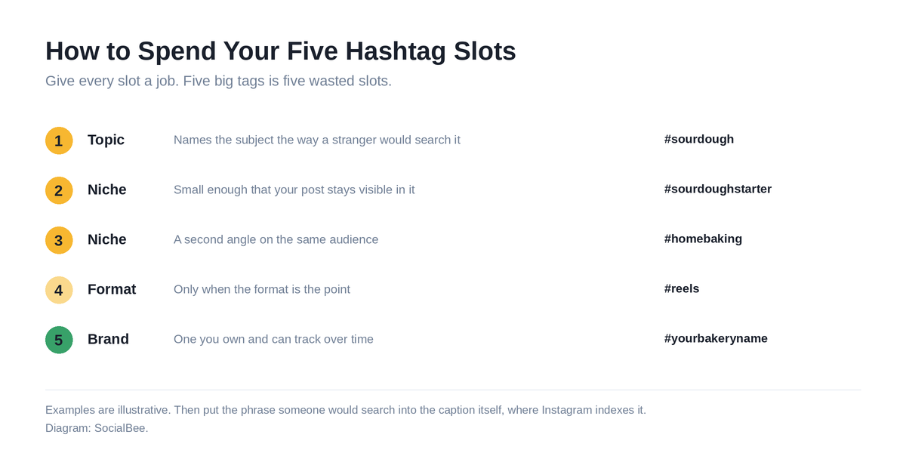

# Trending Instagram Hashtags (August 2026)

**Short answer:** The most-used tags on Instagram this month are still the broad ones, led by #love, #instagood and #reels, plus seasonal picks like #backtoschool. Volume isn't reach, though. Instagram capped captions at five hashtags in December 2025, so which five you spend matters far more than what's trending.

## Key Takeaways

- Just five hashtags per post or Reel. That cap landed in December 2025, down from thirty.
- Comments won't give you extra slots, because the cap counts your caption and your first comment as one pool.
- Your biggest tags are the weakest use of a slot. #love has over two billion posts behind it, and yours lands nowhere.
- Hashtags label your content, they don't distribute it. Mosseri's own line is that they never meaningfully lifted reach.
- Caption keywords now do the job hashtags only pretended to do, because they're indexed in search.

You came for a list, so it's below. Read the section after it before you use any of them, though, because the rules have changed twice in the past eighteen months.

## Trending Instagram Hashtags in August 2026

These are the tags carrying the most volume this month, grouped by what they are for. Volume tells you how crowded a tag is, not how far your post will travel.

| Category | Tags |
| --- | --- |
| Broad and evergreen | #love, #instagood, #photooftheday, #instagram, #beautiful |
| Reels and discovery | #reels, #reelsinstagram, #explorepage, #viralvideo |
| August seasonal | #backtoschool, #endofsummer, #latesummer |
| Motivation and growth | #motivation, #inspiration, #personalgrowth, #selfimprovement |
| Small business | #smallbusiness, #smallbusinessowner, #marketingtips, #socialmediamarketing |

Notice how little those first two rows can do for you. A tag with two billion posts behind it buries yours in under a second, and nobody browsing it was looking for your business.

The seasonal and niche rows are where a slot earns its place. Need help building a set for your own? SocialBee's [free Instagram hashtag generator](https://socialbee.com/free-tools/instagram-hashtag-generator/) will do the first pass for you.

## Instagram Now Caps You at Five Hashtags

This is the change most hashtag lists have not caught up with.

On 19 December 2025, Instagram's @Creators account announced that every post and Reel would be limited to five hashtags, down from the old thirty. It's a platform-enforced limit rather than a suggestion, it applies to every account type, and splitting tags between the caption and the first comment won't buy you more room. [Social Media Today covered the rollout](https://www.socialmediatoday.com/news/instagram-implements-new-limits-on-hashtag-use/808309/) as it happened.

Their stated reasoning was that a handful of targeted tags serves both your performance and everybody else's browsing experience better than a wall of generic ones does. Walls of generic tags were also a spam account's favourite tool.

*[Image source](https://raw.githubusercontent.com/aamir4uu/ishu/refs/heads/claude/facebook-reel-length-post-5fl797/blog/trending-instagram-hashtags/images/instagram-hashtag-limit-change.png)*

That was the second change in a year. [Instagram removed the option to follow a hashtag](https://www.socialmediatoday.com/news/instagrams-removing-option-follow-hashtags/733155/) on 13 December 2024, which quietly ended the one mechanism by which a tag could deliver your post to somebody's feed.

## Do Instagram Hashtags Still Work in 2026?

For reach, no. For context, yes.

The head of Instagram has put it about as bluntly as he can. Hashtags aren't a primary way to increase reach, and whatever effect they once had was marginal. Watch time moves reach. So do likes measured against reach, and sends into DMs.

There is data behind him. Metricool's 2026 Instagram Study looked at 24 million posts from 375,118 accounts and found that posts carrying at least one hashtag averaged **31.7% fewer views and 33.89% fewer interactions** than the platform average.

Read that carefully, because it's a correlation rather than a proven cause. Hashtags almost certainly aren't draining your views. A likelier story: accounts leaning hardest on hashtags are the ones doing everything else less well. Either way, the belief that stacking tags buys distribution doesn't survive the numbers.

What hashtags still do is tell Instagram what your post is about, which feeds search and Explore. Our guide to the [Instagram algorithm](https://socialbee.com/blog/instagram-algorithm/) covers the signals that actually rank you.

## How to Spend Your Five Hashtags

Five slots. Give each one a job instead of grabbing the five biggest tags you can think of.

*[Image source](https://raw.githubusercontent.com/aamir4uu/ishu/refs/heads/claude/facebook-reel-length-post-5fl797/blog/trending-instagram-hashtags/images/instagram-five-hashtag-slots.png)*

1. **One topic tag** that names the subject the way a stranger would search it.
2. **Two niche tags** small enough that your post stays visible in them for more than a minute. Six figures of posts, not nine.
3. **One format tag** if the format is the point, like #reels for a Reel.
4. **One brand or campaign tag** you actually own and can track over time.

Then put the real work into the caption. Caption text gets indexed for search, so the phrase someone would type belongs in your opening line, written as a sentence rather than bolted on as a tag. That single habit does more than any tag you could have added. For the Reels-specific version, see our post on [hashtags for Instagram Reels](https://socialbee.com/blog/hashtags-for-instagram-reels/).

## How to Reuse Hashtag Sets Without Retyping Them

That sounds manageable until you're scheduling twenty posts across four content categories.

SocialBee generates relevant hashtags from your post, then saves them as Hashtag Collections you can drop into any future post. Build one set per content pillar and you'll stop rebuilding the same five tags every Tuesday. It sits inside the same editor you schedule from, so the caption, the tags and the posting time all get decided once. Here is [how hashtag generation works in SocialBee](https://socialbee.com/instagram/scheduler/generate-hashtags/).

## Frequently Asked Questions About Trending Instagram Hashtags

**How many hashtags can you use on Instagram in 2026?**
Five, per post or Reel. That replaced an old maximum of thirty back in December 2025.

**Do hashtags in the first comment still count?**
Yes, and they count against the same five. Moving tags into a comment gains you nothing now.

**Are trending hashtags worth using at all?**
Rarely. A trending tag is a crowded tag, and crowding is what buries you. Use one only when your content genuinely belongs to that moment.

**Do hashtags increase reach on Instagram?**
No. Mosseri has said they never meaningfully did, and Metricool's 2026 study found posts with hashtags underperforming the average by roughly a third on views.

**Can you still follow a hashtag?**
No, that went away in December 2024. Tags no longer put your post into anybody's feed.

**What should I use instead of more hashtags?**
Caption keywords. They're indexed for search, so write the phrase someone would type into your opening line.

## Getting Your Instagram Hashtags Right

An honest trending hashtag list is a short one. Big tags trend because everybody uses them, which is exactly why they won't carry your post.

With five slots, hashtag strategy stops being a numbers game and becomes an editing problem. Pick the ones that describe your post to somebody who has never seen your account before, then spend everything you have left on the caption and the first three seconds.

Want to stop rewriting the same five tags every week? [Start your 14-day free SocialBee trial](https://socialbee.com/) and save a hashtag set for every content category you post. No credit card needed.
